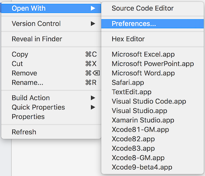
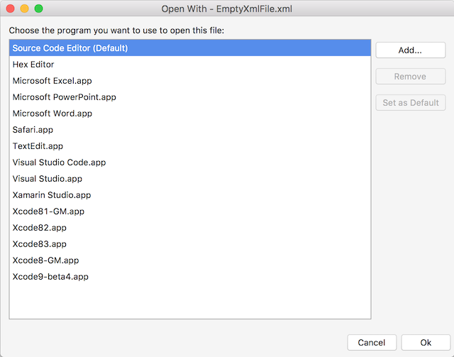
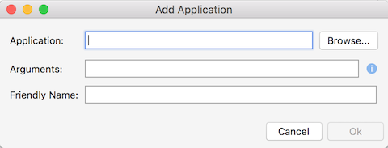

# Customize Open With for MonoDevelop, Xamarin Studio and Visual Studio for Mac

Provides a way to customize the editors used to Open With in MonoDevelop,
Xamarin Studio and Visual Studio for Mac.

## Features

  - Adds a new Preferences... menu to the Open With context menu that allows the
editor used when opening a file to be configured.
  - Supports adding custom applications to the Open With menu.
  - Configuration is saved and will be re-applied the next time the IDE is opened.

### Configuring the Default Editor or Application

To configure the application or editor used for a file you can right click the file
in the Solution window and select Open With - Preferences...

This will open the Open With dialog.

The Open With dialog is based on the dialog that Visual Studio on Windows
provides. The editors and applications that can open the file are displayed in the dialog. The default application is indicated by having
`(Default)` next to its name.

To change the default application or editor used to open the file you can select
it in the Open With dialog and then click the Set as Default button.

## Adding a Custom Application

A custom application can be added from the Open With dialog by clicking
the Add button. This will open the Add Application dialog.

The Browse button can be used to find an application on your machine.

The Friendly Name text box will contain the name that will be displayed in the Open
With menu for the custom application.

Arguments cannot be specified if a Mac application (.app) is used. However if the
application is not a Mac application, for example, it is a C# program, then arguments
can be passed. To pass the filename to the program you can use `{0}` in the
Arguments text box. This placeholder will be expanded to be the full filename when the program is run.

## Removing a Custom Application

In the Open With dialog to remove a custom application you can select the
application and click the Remove button. The Remove button is only enabled for
custom applications that you have added. The built-in editors and applications
cannot be removed.
